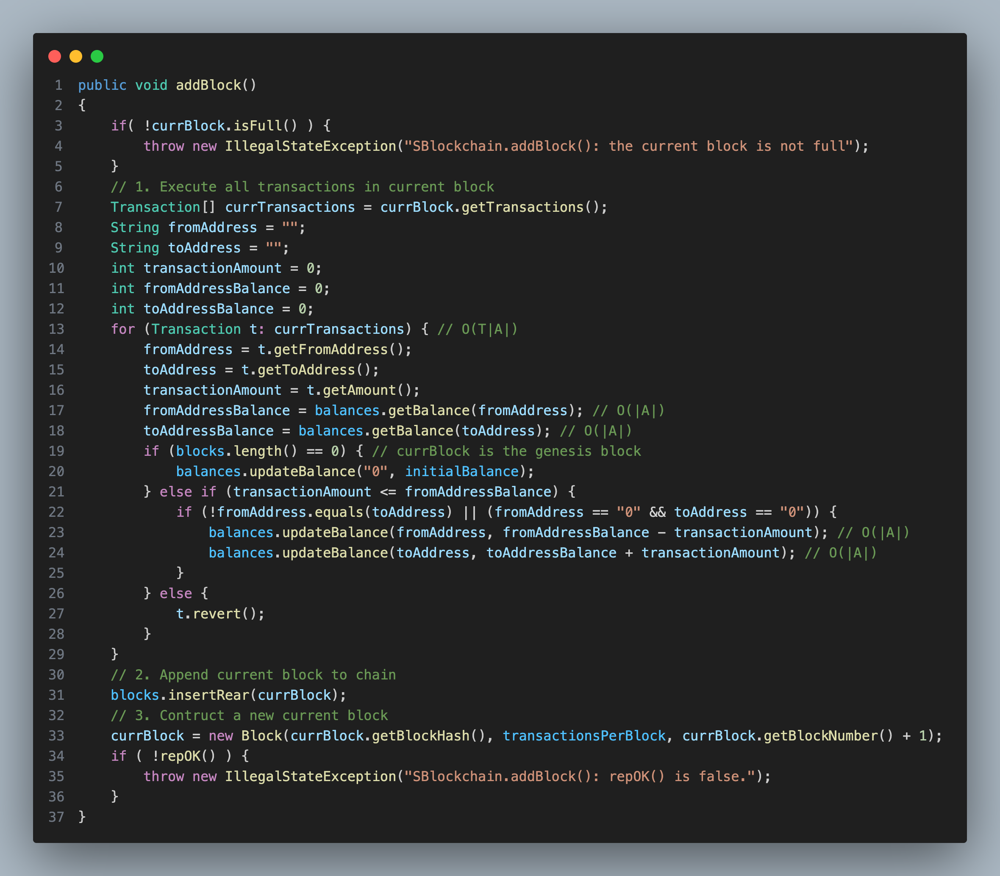
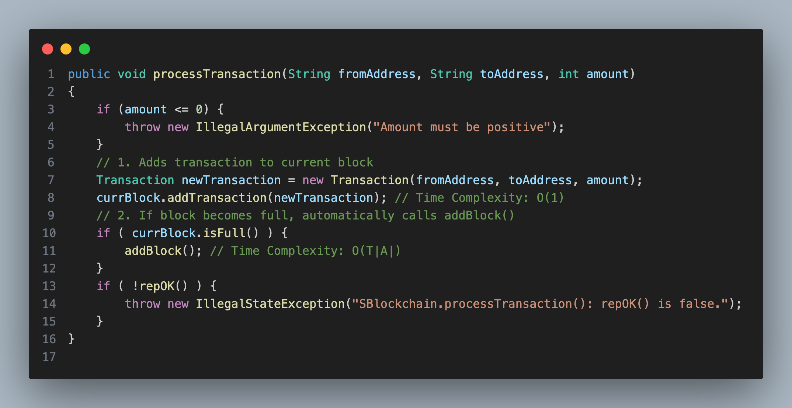

# Data Structures 1 - 25 Winter

# Assignment 01 (Dry)

| Group Member | GTIIT ID  |     Name     |
| :----------: | :-------: | :----------: |
|      01      | 999027873 |   Yue, SHI   |
|      02      | 999014780 | Hongwei, GUO |

[TOC]

## Problem 01: Big-O Simplification

>    Simplify each expression to **Big-O notation**. Justify your answer using the definition of Big-O and/or its properties.
>
>    1.   $𝑂(5𝑛^3 + 3𝑛^2 + 100𝑛 + 1000) + 𝑂(𝑛 \cdot \log{𝑛})$
>    2.   $O(2^n) \cdot O(n^2) + O(3^n)$
>    3.   $𝑂(\log_2{𝑛}) \cdot 𝑂(\sqrt{n}) + 𝑂(𝑛 \cdot \log{n})$
>    4.   $O(n!) + O(2^n) \cdot O(n^3)$

#### 1. $𝑂(5𝑛^3 + 3𝑛^2 + 100𝑛 + 1000) + 𝑂(𝑛 \cdot \log{𝑛})$

Firstly,
$$
𝑂(5𝑛^3 + 3𝑛^2 + 100𝑛 + 1000) = O(n^3).
$$
Moreover,
$$
\lim\limits_{n\to\infty}\frac{n^3}{n\cdot\log{n}} = \infty \implies n^3 \ggg 𝑛 \cdot \log{𝑛}.
$$

Therefore, 

$$
𝑂(5𝑛^3 + 3𝑛^2 + 100𝑛 + 1000) + 𝑂(𝑛 \cdot \log{𝑛}) = O(n^3) + 𝑂(𝑛 \cdot \log{𝑛}) = O(n^3).
$$

#### 2. $O(2^n) \cdot O(n^2) + O(3^n)$

Firstly,
$$
O(2^n) \cdot O(n^2) = O(2^n \cdot n^2).
$$
Moreover,
$$
\lim\limits_{n\to\infty}\frac{3^n}{2^n\cdot n^2} = \lim\limits\frac{\left( \frac{3}{2}\right)^n}{n^2} = \infty \implies 3^n \ggg 2^n \cdot n^2.
$$


Therefore,
$$
O(2^n) \cdot O(n^2) + O(3^n) = O(2^n \cdot n^2) + O(3^n) = O(3^n).
$$

#### 3. $𝑂(\log_2{𝑛}) \cdot 𝑂(\sqrt{n}) + 𝑂(𝑛 \cdot \log{n})$

Firstly,
$$
𝑂(\log_2{𝑛}) \cdot 𝑂(\sqrt{n}) = 𝑂(\sqrt{n} \cdot \log_2{𝑛}).
$$
Moreover,
$$
\lim\limits_{n\to\infty}\frac{𝑛 \cdot \log{n}}{\sqrt{n} \cdot \log_2{𝑛}} = \lim\limits_{n\to\infty} \sqrt{n} = \infty \implies  𝑛 \cdot \log{n} \ggg \sqrt{n} \cdot \log_2{𝑛}.
$$
Therefore,
$$
𝑂(\log_2{𝑛}) \cdot 𝑂(\sqrt{n}) + 𝑂(𝑛 \cdot \log{n}) = 𝑂(\sqrt{n} \cdot \log_2{𝑛}) + 𝑂(𝑛 \cdot \log{n}) = 𝑂(𝑛 \cdot \log{n}).
$$

#### 4. $O(n!) + O(2^n) \cdot O(n^3)$

Firstly,
$$
O(2^n) \cdot O(n^3) = O(2^n \cdot n^3).
$$
Moreover,
$$
\lim\limits_{n\to\infty}\frac{n!}{2^n \cdot n^3} = \infty \implies n! \ggg 2^n \cdot n^3.
$$
Therefore,
$$
O(n!) + O(2^n) \cdot O(n^3) = O(n!) + O(2^n \cdot n^3) = O(n!).
$$

## Problem 2: Sorting Algorithm Analysis
### (a) **<u>*State the precondition required for correctness*</u>**

Pre-condition:

1. array A is not null

2. the range of elements in array A are in [0,9] otherwise the index of B will out of bound

    Thus this algorithm only can be used to sort the array whose elements are in [0,9]

### (b) **<u>*Determine the worst-case time complexity. Provide a detailed asymptotic analysis*</u>**

Overall, the idea of algorithm is:

1. Create an array B with size 10(from 0 to 9), this array B is used to count the times of same digit respect to the index

    For example if 4 appears 5 times in array A, then in array B, in the index 4, B[4] = 5

2. Then we create the array A again according to the array B, that is if B[0] = 5, which means digit 
   
    0 appears 5 times. Then we modify array A: Let position 0 to position 4 be 0 and so on...

Then let's anaylze step by step, assume the length of array A is `n`.

1. `int B[] = new int[]{0,0,0,0,0,0,0,0,0,0};` is cost $c_1$ with times $1$

    Thus this first item of $T(n)$ is $c_1\times 1$

2.  ```java
    for(int i = 0; i < A.length; i++) {
        int index = A[i];
        B[index] = B[index] + 1;
    }
    ```
    This is a loop

    `for(int i = 0; i < A.length; i++) {` is cost $c_2$ with times $n+1$ since i needs to be n to check condition

    `int index = A[i];` is cost $c_3$ with times $n$

    `B[index] = B[index] + 1;` is cost $c_4$ with times $n$

    Thus this second item of $T(n)$ is $c_2\times (n+1)+c_3\times n+c_4\times n$

3. `int k = 0;` is cost $c_5$ with times $1$

    Thus this third item of $T(n)$ is $c_5\times 1$

4. ```java
    for(int i = 0; i <= 9; i++) {
        int j = 0;
        while(j < B[i]) {
            A[k] = i;
            k = k + 1;
            j = j + 1;
        }
    }
    ```
    This is a loop.

    `for(int i = 0; i <= 9; i++)` is cost $c_6$ with times $11$ since i needs to be 10 to check condition

    `int j = 0;` is cost $c_7$ with times $10$

    `while(j < B[i]) {` is cost $c_8$ with times $10\times n$ since it is in the for loop, then $10$ times. Also for this while loop, it ranges from 0 to `B[i]`

    And we know the elements of `B[i]` is the appearing times of the elements in array A

    Thus in the worst case: all element is in `B[i]`, then $\max(B[i])=n$  

    `A[k] = i;` is cost $c_9$ with times $n$

    `k = k + 1;` is cost $c_{10}$ with times $n$

    `j = j + 1;` is cost $c_{11}$ with times $n$

    Thus this fourth item of $T(n)$ is $c_6\times 11 +c_7\times 10+c_8 \times 10 \times n + c_9\times n+c_{10}\times n+c_{11}\times n$

Thus $T(n)=c_1\times 1+c_2\times (n+1)+c_3\times n+c_4\times n+c_5\times 1+c_6\times 11 +c_7\times 10+c_8 \times 10 \times n + c_9\times n+c_{10}\times n+c_{11}\times n$

Then $T(n)=(c_2 + c_3 + c_4 + 10c_8 + c_9 + c_{10} + c_{11})n + (c_1 + c_2 + c_5 + 11c_6 + 10c_7)$

When n goes to infinity, $T(n)\approx (c_2 + c_3 + c_4 + 10c_8 + c_9 + c_{10} + c_{11})n\leq c'n$ for $c'=(c_2 + c_3 + c_4 + 10c_8 + c_9 + c_{10} + c_{11})$ 

Thus it is linear time: O(n) in worst case

### (c) **<u>*Prove correctness using the loop invariant*</u>**

Since there are two loops, then we check the loop invariant twice

1. PC = `{A != null && 0 <= A[p] <= 9 for all p s.t. 0 <= p <= A.length - 1 && B[k] = 0 for all k s.t. 0 <= k <= 9 && i = 0}`

    Inv = `{0 <= i <= A.length && B[k] = |{p : A[p] = k && 0 <= p < i}| for all 0 <= k <= 9}`

    B = `{0 <= i < A.length}`

    QC = `{i = A.length && B[k] = |{p : A[p] = k && 0 <= p < A.length}| for all 0 <= k <= 9}`

    Then we prove correctness by loop invariant theorem

    1. Initialization: Pc $\implies$ Inv

        Suppose we have PC, then `i = 0` and `A != null` $\implies $ `i = 0` and `A.length >= 0`$\implies$ `0 <= i <= A.length`

        Since `i = 0`, then `{p : A[p] = k && 0 <= p < i}` is empty, then `B[k] = 0`

        Since `B[k] = 0 for all k s.t. 0 <= k <= 9 && i = 0` and `0 <= A[p] <= 9 for all p s.t. 0 <= p <= A.length - 1`, then `B[k] = |{p : A[p] = k && 0 <= p < i}|  for all 0 <= k <= 9`

        Thus we prove the invariant holds

    2. Maintenance: Assuming Inv && B holds, the execution of the loop body makes Inv true again

        Suppose we have Inv and B, NTP Inv is true again

        `Inv && B = {0 <= i0 < A.length && B[k] = |{p : A[p] = k && 0 <= p < i0}| for all 0 <= k <= 9}`

        Let `i = i0 + 1`, then `0 <= i0 + 1 <= A.length`, then `0 <= i <= A.length`

        Also since `B[k] = |{p : A[p] = k && 0 <= p < i0}| for all 0 <= k <= 9`, then `B[k] = |{p : A[p] = k && 0 <= p < i0 + 1}| for all 0 <= k <= 9`

        Then `B[k] = |{p : A[p] = k && 0 <= p < i}| for all 0 <= k <= 9`

        Thus Inv is true again

    3. Termination: Inv && not B $\implies$ Qc

        `Inv && not B = {0 <= i <= A.length && i >= A.length && B[k] = |{p : A[p] = k && 0 <= p < i}| for all 0 <= k <= 9}`

        Then `Inv && not B = {i = A.length && B[k] = |{p : A[p] = k && 0 <= p < A.length}| for all 0 <= k <= 9}`

        Thus Qc holds

2. 1. For outer for loop

        PC = `{A != null && 0 <= B[v] for all v s.t. 0 <= v <= 9 && B[0] + B[1] + ... + B[9] = A.length && k = 0 && i = 0}`

        Inv = `{0 <= i <= 10 && k = B[0] + B[1] + ... + B[i-1] && |{p : 0 <= p < k && A[p] = v}| = B[v] for all v s.t. 0 <= v < i && |{p : 0 <= p < k && A[p] = v}| = 0 for all v s.t. i <= v <= 9}`

        B = `{i <= 9}`

        QC = `{k = A.length && |{p : 0 <= p < A.length && A[p] = v}| = B[v] for all v s.t. 0 <= v <= 9 && isSorted(A)}`

        Then we prove correctness by loop invariant theorem

        1. Initialization: PC $\implies$ Inv

            Since `i = 0` and `k = 0`, we have `k = B[0] + ... + B[-1] = 0` holds and `|{p : 0 <= p < 0 && A[p] = v}| = 0 for all v with 0 <= v <= 9`
            
            Thus Inv holds

        2. Maintenance: Assuming Inv && B1 holds, the execution of the loop body makes Inv true again

            Suppose we have Inv and B, NTP Inv is true again

            Inv && B = `{0 <= i0 <= 9 && k = B[0] + B[1] + ... + B[i0-1] && |{p : 0 <= p < k && A[p] = v}| = B[v] for all v s.t. 0 <= v < i0 && |{p : 0 <= p < k && A[p] = v}| = 0 for all v s.t. i0 <= v <= 9}`

            Let `i = i0 + 1`

            Since `0 <= i0 <= 9`, then `0 <= i <= 10`

            Since `k = B[0] + B[1] + ... + B[i0-1]`, `|{p : 0 <= p < k && A[p] = v}| = B[v] for all v s.t. 0 <= v < i0` and `|{p : 0 <= p < k && A[p] = v}| = 0 for all v s.t. i0 <= v <= 9`
            
            By the inner loop’s Qc(proved below), we have `k = B[0] + ... + B[i0-1] + B[i0]` and `|{p : 0 <= p < k && A[p] = i0}| = B[i0]`

            Then we have `k = B[0] + B[1] + ... + B[i-1] && |{p : 0 <= p < k && A[p] = v}| = B[v] for all v s.t. 0 <= v < i` and `|{p : 0 <= p < k && A[p] = v}| = 0 for all v s.t. i <= v <= 9`
            
            Thus Inv holds again

        3. Termination: Inv && not B1 $\implies$ QC

            Since not B, then `i = 10`, then:

            `Inv && not B = {i = 10 && k = B[0] + B[1] + ... + B[9] && |{p : 0 <= p < k && A[p] = v}| = B[v] for all v s.t. 0 <= v < 10 && |{p : 0 <= p < k && A[p] = v}| = 0 for all v s.t. 10 <= v <= 9}`
            
            Thus we have `{k = B[0] + B[1] + ... + B[9] = A.length && |{p : 0 <= p < k && A[p] = v}| = B[v] for all v s.t. 0 <= v <= 9}`

            Since the process of sorting is appending blocks of value v where v is increasing from 0 to 9, thus A is nondecreasing, hence isSorted(A) holds
            
            Thus QC holds
        
    2. For inner while loop (fixed i)

        PC2 = `{fixed i with 0 <= i <= 9 && j = 0 && k = B[0] + B[1] + ... + B[i-1] && |{p : 0 <= p < k && A[p] = v}| = B[v] for all v s.t. 0 <= v < i && |{p : 0 <= p < k && A[p] = v}| = 0 for all v s.t. i <= v <= 9}`

        Inv2 = `{0 <= j <= B[i] && k = B[0] + B[1] + ... + B[i-1] + j && |{p : B[0]+...+B[i-1] <= p < k && A[p] = i}| = j && |{p : 0 <= p < B[0]+...+B[i-1] && A[p] = v}| = B[v] for all v s.t. 0 <= v < i}`

        B2 = `{j < B[i]}`

        QC2 = `{j = B[i] && k = B[0] + B[1] + ... + B[i] && |{p : 0 <= p < k && A[p] = i}| = B[i] && |{p : 0 <= p < k && A[p] = v}| = B[v] for all v s.t. 0 <= v < i}`

        Then we prove correctness by loop invariant theorem

        1. Initialization: PC2 ⇒ Inv2

            Suppose PC2 holds, NTP Inv2
            
            Since `j = 0` , then `0 <= j <= B[i]`
            
            Since `k = B[0] + ... + B[i-1]`, we get `k = B[0] + ... + B[i-1] + j`
            
            Since `k = B[0] + B[1] + ... + B[i-1] && |{p : 0 <= p < k && A[p] = v}| = B[v] for all v s.t. 0 <= v < i`, then `|{p : 0 <= p < B[0] + B[1] + ... + B[i-1] && A[p] = v}| = B[v] for all v s.t. 0 <= v < i`

            Since `|{p : 0 <= p < k && A[p] = v}| = 0 for all v s.t. i <= v <= 9` and `j = 0`, then `|{p : 0 <= p < k && A[p] = i}| = 0`, then `|{p : k <= p < k && A[p] = i}| = 0` since this set is empty, then `|{p : B[0]+...+B[i-1] <= p < k && A[p] = i}| = 0` since `k = B[0]+...+B[i-1]`
            
            Thus Inv2 holds

        2. Maintenance: Assuming Inv2 && B2 holds, the body makes Inv2 true again

            Since B2, then `j0 < B[i]`

            Let `j = j0 + 1; k = k0 + 1`

            Then Inv2 && B2 = `{0 <= j0 < B[i] && k0 = B[0] + B[1] + ... + B[i-1] + j0 && |{p : B[0]+...+B[i-1] <= p < k0 && A[p] = i}| = j0 && |{p : 0 <= p < B[0]+...+B[i-1] && A[p] = v}| = B[v] for all v s.t. 0 <= v < i}`

            Then we have `0 <= j0 + 1 <= B[i] && k0 + 1= B[0] + B[1] + ... + B[i-1] + j0 + 1`

            Then `0 <= j <= B[i] && k= B[0] + B[1] + ... + B[i-1] + j`

            Since `|{p : B[0]+...+B[i-1] <= p < k0 && A[p] = i}| = j0`, then `|{p : B[0]+...+B[i-1]<= p < k0 + 1 && A[p] = i}| = j0 + |{p : A[k0 + 1] = i}|`

            Since we know `A[k0 + 1] = A[k] = i` happens in the while loop body, then `|{p : B[0]+...+B[i-1] <= p < k0 + 1 && A[p] = i}| = j0 + 1 = j`

            Since `|{p : 0 <= p < B[0]+...+B[i-1] && A[p] = v}| = B[v] for all v s.t. 0 <= v < i` and in the loop body we have `A[k] = i`, this doesn't change the value of B[0] to B[i - 1] because `A[k] = i` will only effect `B[i]`

            Thus this invarinat holds again

        3. Termination: Inv2 && not B2 ⇒ QC2

            Since `Inv2` we have `j <= B[i]`, and since `not B2` we have `j >= B[i]`, thus `j = B[i]`
            Also since `k = B[0] + B[1] + ... + B[i-1] + j`, then `k = B[0] + B[1] + ... + B[i]`

            In order to prove `|{p : 0 <= p < k && A[p] = i}| = B[i]`
            
            Let `s = B[0] + ... + B[i-1]`, then `|{p : 0 <= p < k && A[p] = i}| = |{p : 0 <= p < s && A[p] = i}| + |{p : s <= p < k && A[p] = i}|`

            Since the outer-loop precondition of the inner loop:|{p : 0 <= p < s && A[p] = i}| = 0, and from the inner-loop invariant:|{p : s <= p < k && A[p] = i}| = j = B[i]
            
            Then the total is 0 + B[i] = B[i]
            
            In order to prove `|{p : 0 <= p < k && A[p] = v}| = B[v] for all v s.t. 0 <= v < i`

            `|{p : 0 <= p < k && A[p] = v}| = |{p : 0 <= p < s && A[p] = v}| + |{p : s <= p < k && A[p] = v}|`

            Since Inv2:`|{p : 0 <= p < s && A[p] = v}| = B[v] for 0 <= v < i` and since the inner loop’s has `A[k] = i` and it fills the indices `p : s <= p < k` before terminating, then every`A[p] = i`, then for any v < i, no p : s <= p < k satisfies A[p] = v
            
            Thus the set `{p : s <= p < k && A[p] = v}` is empty, thus `|{p : s <= p < k && A[p] = v}| = 0`
            
            Thus the sum is B[v] + 0 = B[v]

            Thus Qc holds

### (d) **<u>*Implement the algorithm in Java*</u>**

Just follow the pseudo code

### (e) **<u>*Supply meaningful unit tests*</u>**

There are two precondition, so I create two negative test to test if the precondition works well

Then I create a positive test to test if this algorithm can sort the array well

## Problem 03: Palindrome Collector

### (a) **<u>*Document pre-/post-conditions in clear English without revealing any internal representation*</u>**

1. `addFirst`

    Precondition:
    1. input char should be lower case and be in [a,z] 
    2. collector should not be full

    Postcondition: 
    1. the length of new collector increase by 1 after adding
    2. the first element of new collector becomes ch
    3. from the second element to the last element of the new collector equals the elements in original collector in order

2. `addLast`

    Precondition:
    1. input char should be lower case and be in [a,z] 
    2. collector should not be full

    Postcondition: 
    1. the length of new collector increase by 1 after adding
    2. the last element of new collector becomes ch
    3. from the first element to the previous one of the last element of the new collector equals the elements in original collector in order 

3. `removeFirst`

    Precondition:
    1. collector should not be empty

    Postcondition: 
    1. the length of new collector decrease by 1 after removing
    2. the first element of new collector becomes the second element of original collector
    3. from the second element to the last element of the original collector equals the elements in new collector in order 
    4. return the character that is the first element of original collector

4. `removeLast`

    Precondition:
    1. collector should not be empty

    Postcondition: 
    1. the length of new collector decrease by 1 after removing
    2. the last element of new collector becomes the previous element of the last element of original collector
    3. from the first element to the previous element of the last element of the original collector equals the elements in new collector in order 
    4. return the character that is the last element of original collector

5. `isPalindrome`

    Precondition:
    None

    Postcondition: 
    1. return true iff the collector reads the same forward and backward
    2. the collector is not modified

6. `isEmpty`

    Precondition:
    None

    Postcondition: 
    1. return true iff the size of collector is 0
    2. the collector is not modified

7. `size`

    Precondition:
    None

    Postcondition: 
    1. return the number of characters in the collector
    2. the collector is not modified

### (b) **<u>*Declare all fields needed to guarantee O(1) time for every operation except for isPalindrome*</u>**

1. A char array `char[] collector` that represents the collector, since the collector is a fixed-size circular char arrya
2. Capacity of collector `int capacity` that fixes the max number of characters that the collector can have
3. DEFAULT_CAPACITY `final int DEFAULT_CAPACITY` that is a constant capacity and is used when we construct the collector without passing parameter: capacity
4. The head of the collector `int head` that indicate the first element in the collector, since the array is circular and we will do insertion and removal, then head will move, then we need its position
5. The tail of the collector `int tail` that indicate the last element in the collector, since the array is circular and we will do insertion and removal, then tail will move, then we need its position
6. The size of the collector `int size` that tell us the currently used size of collector, since we need to know if the collector is full

If we have those fields, then we will have a collector that is similar to double-ended queue
1. `addFirst`

    This method is O(1) since we know the position of first element: `head`, then we just move `head` forward one step and add element in that position and increase the `size`
2. `addLast`

    This method is O(1) since we know the position of last element: `tail`, then we just move `tail` backward one step and add element in that position and increase the `size`
3. `removeFirst`

    This method is O(1) since we know the position of last element: `head`, then we can read the first element and return it. To remove it, we move `head` backward one step and decrease the `size`
4. `removeLast`

    This method is O(1) since we know the position of last element: `tail`, then we can read the last element and return it. To remove it, we move `tail` forward one step and decrease the `size`
5. `isEmpty`

    This method is O(1) since we have the field `size` , then just check if the `size` is 0
6. `size()`
    This method is O(1) since we directly return the field `size`

### (c) **<u>*Provide a representation invariant expressed in English and describe an abstract function that explains, in terms of the ADT, what the concrete state means*</u>**

**Representation invariant :**

1. Capacity is positive and not null
2. The length of collector equals capacity
3. Size is bounded by 0(included) and capacity(included)
4. Head and tail are valid: ranging from 0(included) to capacity(exculded)
5. Head, tail and size satisfy the property of circular array
6. Every character in collector is lowercase letter from 'a' to 'z'

`RI(R) = capacity > 0 ∧ collector.length = capacity ∧ 0 ≤ size ≤ capacity ∧ 0 ≤ head,tail < capacity ∧ tail = (head + size) mod capacity ∧ ∀i < size: 'a' ≤ collector[(head+i) mod capacity] ≤ 'z'`

---
**Abstraction function :**

- Abstract values (A): finite sequences of lowercase characters `['a'..'z']`
- Representation values (R): `R = ⟨collector : char[capacity], capacity : int, head : int, tail : int, size : int⟩`
- Abstraction Function 

    Let `AF : R ⇒ A` s.t. $(AF(R) = L \iff |L| = R.\text{size} \ \land\ \forall k \in \{1,\dots,R.\text{size}\}:\ L[k] = R.\text{collector}[(R.\text{head} + k - 1) \bmod R.\text{capacity}])$
    
    In English: the abstract list `L` is the `size` elements starting at `head` in `collector`, max size limited by `capacity`
    
    

## Problem 04: Basic Blockchain System

### Method `updateBalance(String, int)` and `getBalance(String)`

````java
// File: BalanceImp.java

// private final Sequence<AddressBalancePair> addBalPairs;

public void updateBalance(String address, int newBalance)
{
    AddressBalancePair newPair = new AddressBalancePair(address, newBalance);
    int index = addBalPairs.indexOf(newPair); // Time Complexity: O(|A|)
    if (index == -1) {
        addBalPairs.insertRear(newPair); // add new pair, O(1)
    } else {
        addBalPairs.updateAt(index, newPair); // update address-balance pair, O(|A|)
    }
}

public int getBalance(String address)
{
    int balanceOfAddress;
    AddressBalancePair target = new AddressBalancePair(address, 0);
    int index = addBalPairs.indexOf(target); // Time Complexity: O(|A|)
    if (index != -1) {
        balanceOfAddress = addBalPairs.at(index).getBalance(); // Time Complexity: O(|A|)
    } else {
        balanceOfAddress = 0; // address not found
    }
    return balanceOfAddress;
}
````

Time Complexity: `O(|A|)`

Explaination: 

-   `|A|` is the number of distinct addresses that currently hold a balance, which is also equal to the number of addresses stored in `addBalPairs`.

-   Methods `indexOf()`, `at()` and `updateAt()` of class `Sequence` all require iterating the whole linear structure used to implement the class, so the (worst-case) time complexities of them are `O(|A|)`.
-   In the implementation of methods `updateBalance(String, int)` and `getBalance(String address)` in class `BalanceImp`, methods  `indexOf()`, `at()` and `updateAt()` are involved (line `8`, `12`, `20` and `22`). 
-   Therefore, the time complexities of these two methods are both `O(|A|)`.


### Method `addBlock()`



Time Complexity: `O(T|A|)`

Explaination:

-   `T` is the number of transactions stored in a block and `|A|` is the number of distinct addresses that currently hold a balance.
-   The first step of method `addBlock` is to execute all transactions stored in the current block (i.e. `currBlock`).
-   In the execution of each transaction, to get access to the balances of `fromAddress` and `toAddress`, we call methods `getBalance()` of class `Balance` (line `17` and `18`), which has been analysed above, and its time complexity is `O(|A|)`.
-   Also in the exeution of each transaction, if the transaction is valid (`transactionAmount <= fromAddressBalance`), method `updateBalance()` will be called, whose time complexity is `O(|A|)`.
-   Hence, the time complexity of executing each transaction is `O(|A|)`.
-   Overall, the time complexity of excuting of all `T` many transactions is `T.O(|A|) = O(T|A|)`.


### Method `processTransaction(String, String, int)`



Time Complexity: `O(T|A|)`

Explaination:

-   The time complexity of all lines in `processTransaction`  is `O(1)` except line `11`, where method `addBlock()` is called, and the time complexity of this method is `O(T|A|)` , as analysed above.
-   Therefore, the time complexity of `processTransaction()` is `O(T|A|)`.
