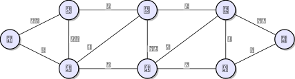
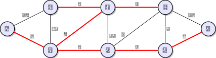
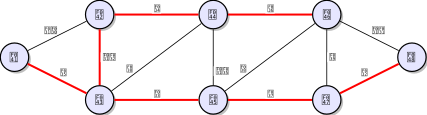
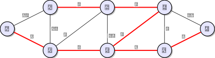

### 1. Connecting Cities – 20 pts (Dry/Wet)

A government plans to conn*ect* 8 cities (A-H) with a high-speed rail network. The potential tracks and their construction costs (in millions) are listed below.

Edges: (A,B, 10), (A,C, 5), (B,C, 12), (B,D, 4), (C,D, 8), (C,E, 3), (D,E, 15), (D,F, 6), (E,F, 8), (E,G, 7), (F,G, 9), (F,H, 11), (G,H, 2).

1. (4 pts) Compute the minimum network that connects all cities (hint: use Kruskal's)

   Solution

   Here is the graph:

   

   | Edge | $\in ?$ |                                 Reason                                 |
   | :----: | :-: | :----------------------------------------------------------------------: |
   |   $(G,H)=2$   | $\checkmark$ |                      There is no cycle with (G,H)                      |
   |   $(C,E)=3$   | $\checkmark$ |                  There is no cycle with (G,H), (C,E)                  |
   |   $(B,D)=4$   | $\checkmark$ |               There is no cycle with (G,H), (C,E), (B,D)               |
   |   $(A,C)=5$   | $\checkmark$ |           There is no cycle with (G,H), (C,E), (B,D), (A,C)           |
   |   $(D,F)=6$   | $\checkmark$ |        There is no cycle with (G,H), (C,E), (B,D), (A,C), (D,F)        |
   |   $(E,G)=7$   | $\checkmark$ |    There is no cycle with (G,H), (C,E), (B,D), (A,C), (D,F), (E,G)    |
   |   $(C,D)=8$   | $\checkmark$ | There is no cycle with (G,H), (C,E), (B,D), (A,C), (D,F), (E,G), (C,D) |
   |   $(E,F)=8$   | $\times$ |                              $E-C-D-F-E$ is a cycle                              |
   |   $(F,G)=9$   | $\times$ |                              $F-D-C-E-G-F$ is a cycle                              |
   |   $(A,B)=10$   | $\times$ |                              $A-C-D-B-A$ is a cycle                              |
   |   $(F,H)=11$   | $\times$ |                              $H-G-E-C-D-F-H$ is a cycle                              |
   |   $(B,C)=12$   | $\times$ |                              $B-D-C-B$ is a cycle                              |
   |   $(D,E)=15$   | $\times$ |                              $D-C-E-D$ is a cycle                              |

   Thus the minimum network that connects all cities are graph composed with edges: (G,H), (C,E), (B,D), (A,C), (D,F), (E,G), (C,D) and costs: 35

   Graph: 
2. (8 pts) Due to a strategic decision the government mandates that the expensive track between (B, C) (Cost 12) must be built and included in the network.

   - Describe the algorithm/modification needed to satisfy this constraint while keeping the total cost as low as possible.

     Solution

     Before using the Kruskal's Algorithm, we first add the BC edge. Then in all cases, BC will be in the MST graph after running the algorithm. And algorithm will guarantee that the total cost is the lowest
   - What is the new set of edges and the new total cost?

     Solution

     | Edge | $\in ?$ |                                 Reason                                 |
     | :----: | :-: | :----------------------------------------------------------------------: |
     |   $(B,C)=12$   | $\checkmark$ |                           the mandatory edge                           |
     |   $(G,H)=2$   | $\checkmark$ |                  There is no cycle with (B,C), (G,H)                  |
     |   $(C,E)=3$   | $\checkmark$ |               There is no cycle with (B,C), (G,H), (C,E)               |
     |   $(B,D)=4$   | $\checkmark$ |           There is no cycle with (B,C), (G,H), (C,E), (B,D)           |
     |   $(A,C)=5$   | $\checkmark$ |        There is no cycle with (B,C), (G,H), (C,E), (B,D), (A,C)        |
     |   $(D,F)=6$   | $\checkmark$ |    There is no cycle with (B,C), (G,H), (C,E), (B,D), (A,C), (D,F)    |
     |   $(E,G)=7$   | $\checkmark$ | There is no cycle with (B,C), (G,H), (C,E), (B,D), (A,C), (D,F), (E,G) |
     |   $(C,D)=8$   | $\times$ |                              $D-B-C-D$ is a cycle                              |
     |   $(E,F)=8$   | $\times$ |                              $E-C-B-D-F-E$ is a cycle                              |
     |   $(F,G)=9$   | $\times$ |                              $F-D-B-C-E-G-F$ is a cycle                              |
     |   $(A,B)=10$   | $\times$ |                              $A-C-B-A$ is a cycle                              |
     |   $(F,H)=11$   | $\times$ |                              $H-G-E-C-B-D-F-H$ is a cycle                              |
     |   $(D,E)=15$   | $\times$ |                              $D-B-C-E-D$ is a cycle                              |

     Thus the minimum network that connects all cities are graph composed with edges: (B,C), (G,H), (C,E), (B,D), (A,C), (D,F), (E,G) and costs: 39

     Graph: 

   Hint: Think about how the inclusion of this edge affects the cycle property for other edges.
3. (3 pts) Is the solution found in part (1) unique? If yes, explain why. If no, list one alternative edge that could replace an existing edge in the solution without changing the total cost.

   Solution

   No, since there are two edges with same weight: $(C,D)=(E,F)=8$, thus we can interchange them if both choices will not create a cycle, then the result is still minimum since they have the same weight

   Since $(C,D)$ or $(E,F)$ won't create a cycle, thus it is not unique.

   Thus another choice of the minimum network that connects all cities are graph composed with edges: (G,H), (C,E), (B,D), (A,C), (D,F), (E,G), (E,F) and costs: 35

   Graph: 
4. (5 pts) Implement solutions for 1. and 2. in Java. Provide at least one meaningful test.