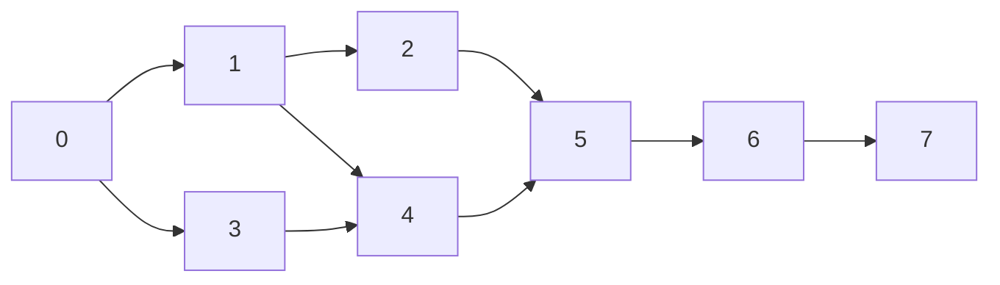
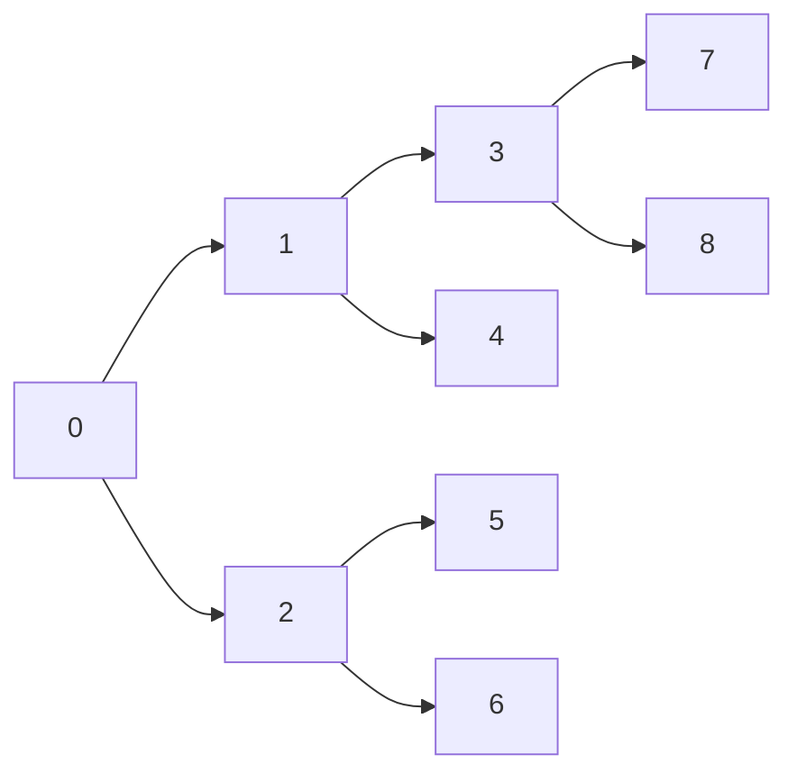

# Problem 02: DevOps Pipeline (Topological Sort)

>   Consider the following software build tasks and their dependencies:
>
>   • 1: Linting (No deps)
>
>   • 2: Unit Tests (Requires 1)
>
>   • 3: Integration Tests (Requires 2)
>
>   • 4: Security Scan (Requires 1)
>
>   • 5: Build Docker Image (Requires 2 and 4)
>
>   • 6: Deploy to Staging (Requires 3 and 5)
>
>   • 7: E2E Tests (Requires 6)
>
>   • 8: Promote to Prod (Requires 7)

## Item a. 

>   Model the dependencies using a DAG (Directed Acyclic Graph).

Adjacency List:

| Vertex | Adjacent Vertices |
| :----: | :---------------: |
|   0    |       1, 3        |
|   1    |       2, 4        |
|   2    |         5         |
|   3    |         4         |
|   4    |         5         |
|   5    |         6         |
|   6    |         7         |
|   7    |         /         |

## Item b. 

>   Provide solutions of **Topological Sort** using DFS and using **BFS**

-   **topological DFS solution**: 0, 1, 2, 3, 4, 5, 6, 7
-   **topological BFS solution**: 0, 3, 1, 4, 2, 5, 6, 7

## Item c. 

>   Assuming that non-dependent tasks can run **in parallel**, what is the minimum number of steps required to complete the pipeline? (Assume each task takes 1 time step). 
>
>   List the tasks running (including those in parallel) at each step.

Minimum number of steps required to complete the pipline: 6

| Step |                 Tasks                  |
| :--: | :------------------------------------: |
|  1   |                   0                    |
|  2   | 1, 3 (since 1 and 3 are non-dependent) |
|  3   | 2, 4 (since 2 and 4 are non-dependent) |
|  4   |                   5                    |
|  5   |                   6                    |
|  6   |                   7                    |

## Item d. 

>   Implement the items b. and c. in Java. Provide at least one meaningful test.

See the Java code in [code](./code). 

Another meaningful test:

-   **topological DFS**: 0, 1, 3, 7, 8, 4, 2, 5, 6
-   **topological BFS**: 0, 2, 1, 6, 5, 4, 3, 8, 7
-   **topological Parallel**: (0), (2, 1), (6, 5, 4, 3), (8, 7)