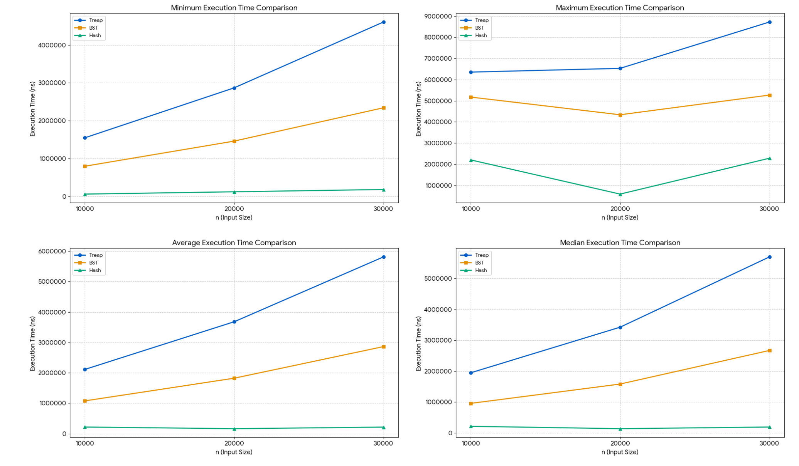

### 4. Montecarlo approach for assessing the expected height of Treap and BST
We recall the principles of the Monte Carlo approach, as introduced in Introduction to Computer Science M. The Monte Carlo method is a computational technique that relies on random sampling to solve problems that, although theoretically solvable analytically, may be difficult or complex to resolve directly. The core idea is to simulate many random outcomes of a process, observe the results, and use statistical analysis to estimate the quantity of interest.

Hints: 
- Modify your Treap, BSTs and HashTable implementations as needed to collect relevant data. 
- Write a Java program that uses the Monte Carlo method to estimate the expected height of randomly generated Treaps for various values of n (using random input sequences of size n). Use a value of n big enough (e.g, 1000). 
- You can create sequences of inputs, of size between $[0..n]$. 
- Even sequences are random, make sure you use the same sequences for the 3 data structures. 
- Your program does not need to generate plots; it should simply output the collected data. You can analyze this data graphically later using external tools or even manually. 
- Be sure to include the data used to support your analysis.

---

1. Use the Monte Carlo approach to assess whether the expected height of a Treap with n elements is $O(\log n)$. You may support your conclusion with analytical or graphical representations of your results.

    Solution

    Here is the output data calculated by java file `MonteCarlo`.
    ```java
    1. Treap height Test (O(log n))
    n || times || treapHeightAverage / Log2(n)
    10000 || 300 || 2.3615803159839324
    20000 || 300 || 2.373134744453463
    30000 || 300 || 2.3846864771928207
    ```
    - `n` is the nodes of treap. 
    - `times` is the times of excution with different random sequence. 
    - `treapHeightAverage / Log2(n)` is $\dfrac{\text{treapHeightAverage}}{\log_2n}$ where `treapHeightAverage` is calculated by $\dfrac{\sum_{\text{different random sequence}} \text{treapHeight}}{\text{times}}$
    
    Since we want to prove the height of treap is log2(n). Then with different n, no matter how big or small the n is, $\dfrac{\text{treapHeightAverage}}{\log_2n}$ should be same. And from the output we can see, for different $n$, `treapHeightAverage / Log2(n)` is approximately $2.36,2.37,2.38$. They are almost same. The subtle difference should be allowed.

    Thus we conclude that the height of treap is $\log_2n$

2. Use the same set of inputs sequences used to build the Treaps to build Binary Search trees. Compare pairwise the difference of heights between Treap and BST (for the same cases). Provide and analysis of the maximum, minimum, average and median heights.

    Solution

    Here is the output data calculated by java file `MonteCarlo`.
    ```java
    2. Treap, BST Height Comparison(heightDifference = HD = Treap.Height - BST.Height)
    n || times || HD_Min || HD_Max || HD_Average || HD_Median
    10000 || 300 || -9 || 9 || -0.18333333333333332 || 0.0
    20000 || 300 || -9 || 9 || 0.17333333333333334 || 0.0
    30000 || 300 || -9 || 8 || 0.30666666666666664 || 0.0
    ```
    We use the same set of inputs sequence, which is guranteed by the design of codes.
    - `n` is the nodes of treap. 
    - `times` is the times of excution with different random sequence. 
    - `HD_Min` is $\min_{\text{different random sequence}}\{\text{Treap.Height} - \text{BST.Height}\}$. 
    - `HD_Max` is $\max_{\text{different random sequence}}\{\text{Treap.Height} - \text{BST.Height}\}$. 
    - `HD_Average` is $\dfrac{\sum_{\text{different random sequence}}\{\text{Treap.Height} - \text{BST.Height}\}}{\text{times}}$. 
    - `HD_Median` is $\text{median}_{\text{different random sequence}}\{\text{Treap.Height} - \text{BST.Height}\}$. 
    
    - We can see that for different number of nodes `n`, the min and max difference of height are relatively balanced: `-9 v.s. 9`, `-9 v.s. 9`, `-9 v.s. 8`, which means the height of treap has a similar performance with the height of BST. The height of treap may be longer than the height of BST to some extent. But the height of BST will also be longer than the height of treap to the same extent in some cases. Thus for extreme cases, the height of BST and treap have a similar performance.
    - Also the average difference of height are almost $0$: $-0.18,0.17,0.31$, which means the average height between treap and BST are almost same.
    - Furthermore, the median difference of height are $0$ as well: $0.0,0.0,0.0$, which means the center of difference height between treap and BST is $0$. Then in the center of distribution, we can see that the height of treap and BST are same.

    Thus we conclude that the height of BST and ttreap are same theoretically.

3. Use the same of inputs sequences used to build a Hashtable with close addressing. Compute the load factor for every sequence and compare average execution times of Treap, BST and Hasthable. Provide and analysis of the maximum, minimum, average and median execution times.

    Solution

    Here is the output data calculated by java file `MonteCarlo`.
    ```java
    3: Execution Time Comparison
    n || times || treap(min,max,average,median) || bst(min,max,average,median) || hash(min,max,average,median) || loadFactor for Hash
    10000 || 300 || (1546700, 6354400, 2110981.0, 1948350.0) || (795800, 5173200, 1076163.3333333333, 957250.0) || (60200, 2201300, 215427.0, 214850.0) || 33.333333333333336
    20000 || 300 || (2867600, 6532100, 3679899.0, 3423850.0) || (1460600, 4336800, 1822287.6666666667, 1583250.0) || (121100, 584800, 161402.0, 137950.0) || 66.66666666666667
    30000 || 300 || (4608100, 8724200, 5815631.666666667, 5700350.0) || (2341300, 5268700, 2862956.3333333335, 2671000.0) || (182000, 2282000, 213477.33333333334, 191450.0) || 100.0
    ```
    We use the same set of inputs sequence, which is guranteed by the design of codes.
    
    Here is the graph of comparison generated by python

    

    From the graph, we can see that the the rank of min, max, average or median excution time is always $\text{Treap}>\text{BST}>\text{HashTable}$.

    Thus the excution time of Hash Table is better than BST and BST is better than Treap.